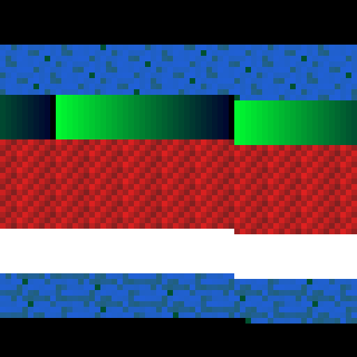
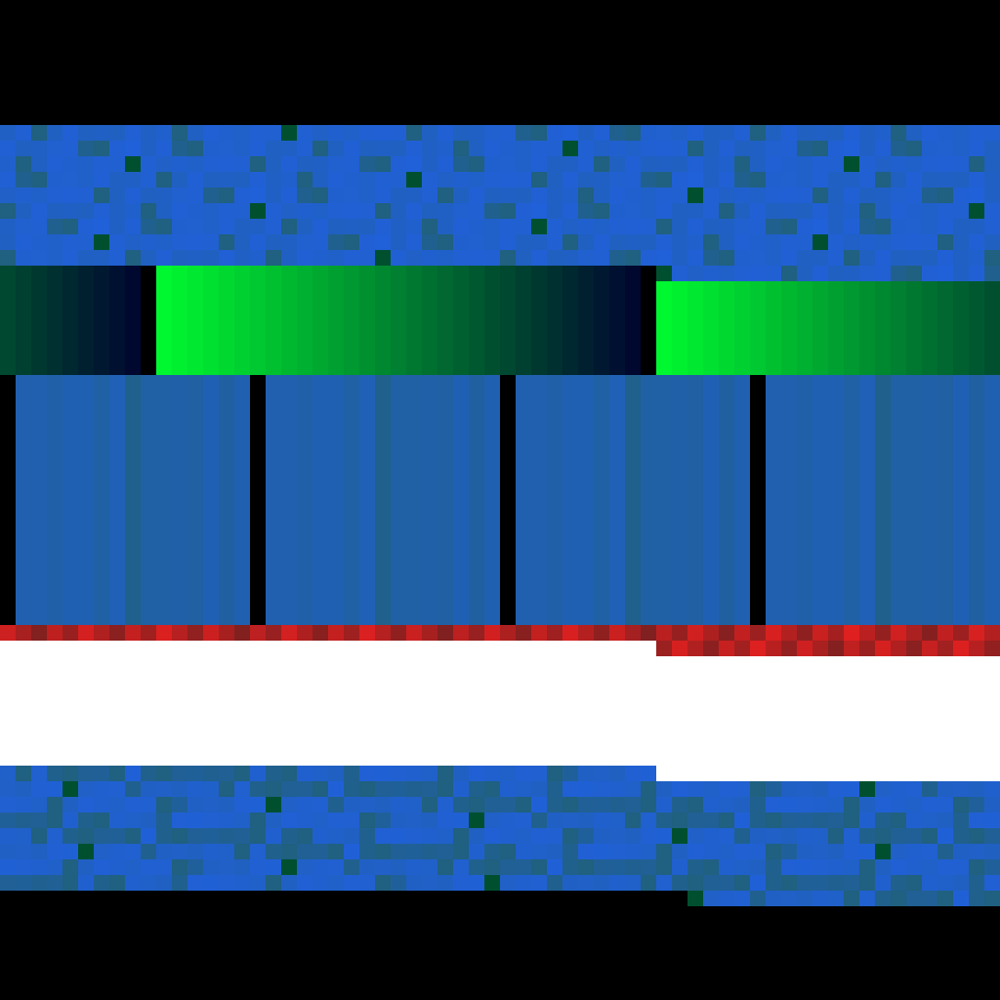

# printb

Render binary files as color images.

A binary file has shape. Padding, strings, tables, compressed regions, and
patches leave different byte textures. `printb` gives a quick picture of that
shape without knowing the file format.

<p align="center">
  
</p>

Black is null padding, green is control bytes, blue is printable ASCII, red is
high-byte data, and white is `0xff`.

## Install

```bash
cargo install --git https://github.com/arclabs561/printb
```

Or build from a checkout:

```bash
cargo build --release
```

## Usage

```bash
printb input.bin -n 4096 -w 64 -o image.png
```

The `-s` flag skips bytes before rendering, `-n` limits how many bytes are read,
`-w` sets the byte-grid width, and `-o` sets the output path.

## Comparing Binary Versions

Binary images are useful when the exact bytes matter but a hex dump is too narrow
to scan. A small byte-level change can become a visible block, band, or repeated
pattern.

| Before | After |
| --- | --- |
|  |  |

The second image patches an ASCII marker into a region that was previously
high-byte data. The change shows up as a blue block. The same approach can help
inspect packed regions, appended payloads, stripped symbols, or unexpected
changes between builds.

To regenerate the example files and images:

```bash
perl examples/make-fixtures.pl
cargo run -- target/example-before.bin -n 4096 -w 64 -o examples/image.png
cargo run -- target/example-after.bin -n 4096 -w 64 -o examples/patched.png
```

## Related Work

- [Conti and Dean, Visual Reverse Engineering of Binary and Data Files](https://vizsec.org/files/2008/Conti.pdf):
  byte plots, entropy, byte frequency, strings, and n-grams as file-independent
  views of unknown data.
- [Christopher Domas, The Future of RE: Dynamic Binary Visualization](https://www.youtube.com/watch?v=4bM3Gut1hIk):
  the well-known talk that connects visual pattern recognition to reverse
  engineering practice.
- [CantorDust](https://inside.battelle.org/blog-details/battelle-publishes-open-source-binary-visualization-tool):
  a Ghidra plugin for digraph and Hilbert-style binary visualization.
- [Aldo Cortesi's binvis work](https://corte.si/posts/visualisation/binvis/) and
  [binvis.io](https://binvis.io/): Hilbert-curve layouts that preserve local
  structure when mapping bytes onto a square.
- [Stairwell's Hilbert-curve malware-analysis writeup](https://stairwell.com/blog/hilbert-curves-visualizing-binary-files-with-color-and-patterns/)
  and [8dcc/bin-graph](https://github.com/8dcc/bin-graph): recent practitioner
  examples of binary images for file analysis.

`printb` is smaller than those tools. It writes a fixed-width PNG from bytes on
disk and leaves interactive navigation, digraph plots, and Hilbert-curve layouts
to heavier analyzers.

## License

Dual-licensed under MIT or the UNLICENSE.
